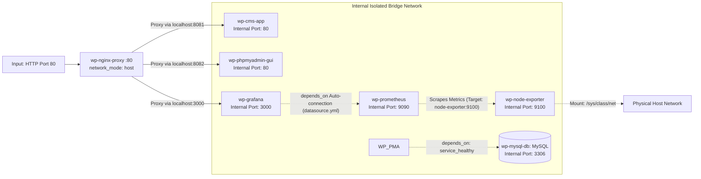

# Fault-Tolerant Web Stack with Comprehensive Monitoring and Observability 🏗️ 📊 🐳

---

## Description

This repository represents the third and most advanced evolutionary layer in a series of WordPress infrastructure deployment projects, building directly upon the architecture of the previous repository [wordpress-infra-nginx-compose](https://github.com/viktor-babeev/wordpress-infra-nginx-compose.git). The project scales the secure Reverse Proxy architecture up to full production-grade industry standards by introducing a complete **Observability Stack** based on Prometheus, Grafana, and Node Exporter for continuous metrics collection and comprehensive system health monitoring.

The entire ecosystem is orchestrated via a declarative **Docker Compose** manifest. The high-performance **Nginx** web server operates directly within the host machine's network namespace (`network_mode: host`), serving as a unified gateway (Ingress) on port `80` for both user traffic and telemetry dashboards. Every single backend component (`wordpress`, `phpmyadmin`, `mysql`), as well as data collection servers, visualization engines and system agents (`prometheus`, `grafana`, `node-exporter`) is completely hidden from the external world — they are isolated within an internal Docker network and locked onto the host server's loopback interface `127.0.0.1`, which entirely eliminates unauthorized external access.

To comply with information security requirements and bypass the virtualization constraints of local development environments, the **Node Exporter** agent runs inside an isolated `bridge` network with its port securely published on `127.0.0.1:9100`. The collection of authentic hardware utilization metrics (CPU, RAM, disks) and traffic from real physical network interfaces of the server (`eth0`/`wlan0`) is achieved via read-only (`:ro`) mounting of Linux kernel system directories (`/proc`, `/sys`, `/sys/class/net`) alongside the overriding of internal utility flags.

Domain path routing is completely encapsulated within `nginx.conf`: the root context `/` is proxied to WordPress, the `/phpmyadmin/` endpoint (with mandatory prefix stripping) routes to the Database GUI, and the `/grafana/` endpoint forwards to the visualization interface. The seamless operation of Grafana behind the Reverse Proxy (correct rendering of relative paths, CSS/JS scripts and websockets) is guaranteed by the injection of `GF_SERVER_ROOT_URL` and `GF_SERVER_SERVE_FROM_SUB_PATH` environment variables. Furthermore, data source connectivity and dashboard deployment are fully automated under the IaC (GitOps) paradigm: the `datasource.yml` and `dashboards.yml` files declaratively import Prometheus and deploy the Node Exporter Full dashboard in **Read-Only** mode (`"editable": false`), this makes the graphs immune to accidental UI modifications and permanently removes save prompts upon exiting or entering.

> ❗ **CRITICAL SECURITY NOTE:** In a real production workflow, the `.env` file contains sensitive secrets and **MUST NEVER** be committed to version control systems. It is present in this repository **EXCLUSIVELY for demonstration and quick-start testing purposes**. Always ensure your `.env` file is explicitly included in your `.gitignore` configuration before deploying live environments.

---

## 🚀 Architectural Key Features

* **End-to-End Monitoring Perimeter Isolation (Zero Public Observability Ports):** Not only databases and CMS, but all new telemetry components (`prometheus`, `grafana`, `node-exporter`) are completely hidden from the external network. Grafana (`3000`) and Prometheus (`9090`) ports are strictly locked onto the host's loopback interface `127.0.0.1`, while the Node Exporter agent operates inside an isolated Docker network without publishing ports externally. Access to monitoring dashboards is possible exclusively through the unified secure Ingress gateway of the Nginx web server.
* **Declarative Configuration Ingestion (IaC / GitOps Datasource Provisioning):** The project entirely eliminates manual data source connection and dashboard importing via the web interface. The configuration files `datasource.yml` and `dashboards.yml` are automatically mounted into the Grafana provisioning directory in read-only (`:ro`) mode. Upon the very first cold start of the stack, Grafana instantly and seamlessly connects Prometheus as the primary data source and spins up the actual dashboard.
* **Isolated Low-Level System Metrics Collection (Secure Node Exporter Footprint):** The Node Exporter container harvests precise physical hardware metrics from the host by mounting Linux kernel system directories (`/proc`, `/sys`, `/`) in a secure read-only (`:ro`) mode. Utilizing the `--path.procfs` and `--path.sysfs` flags isolates the execution environment, guaranteeing that the container possesses no privileges to alter host operating system files.
* **Unified Domain Namespace Integration (Sub-path Proxying):** The Nginx configuration channels the `/grafana/` path to the internal Grafana port. To prevent broken relative paths, styles, and scripts within the web interface, the `GF_SERVER_ROOT_URL` and `GF_SERVER_SERVE_FROM_SUB_PATH=true` variables are injected into the visualization container, ensuring flawless web panel rendering behind the reverse proxy.
* **Idempotent Health Control (Healthcheck-driven Declarative Control):** Web applications (`wordpress` and `phpmyadmin`) do not start simultaneously with the database; instead, they declaratively await a `condition: service_healthy` state from the database container. The validation is performed via the `mysqladmin ping` utility inside the container. This completely eliminates dependent service crashes during initial boot due to the database not being ready to accept TCP connections, ensuring a predictable startup sequence for the entire stack.
* **LTS/Stable Version Locking and Synchronization:** Versions of all services across the board, including data collection components (`Prometheus v2.51.0`, `Grafana 10.4.2`, `Node Exporter v1.8.1`), are extracted into the `.env` environment file and locked onto verified stable releases.
* **Operations and Fault Tolerance:** For all mission-critical services, a declarative `restart: always` policy is configured, providing automatic process recovery in the event of application failures or scheduled server reboots.
* **Grafana UI Immunity and Save Prompt Protection (Immutable Read-Only Dashboards):** Implementing automated stream patching of the dashboard JSON matrix (`"editable": false`) forces the imported visualization panel into a strict "Read-Only" mode. This blocks accidental graph structure degradation by users and completely terminates annoying Grafana warning prompts demanding to save changes when closing the browser tab.

---

## Business Context

This stage of infrastructure evolution elevates web stack management to the level of **Enterprise Reliability & Proactive Observability standards**. Vetting continuous Prometheus metrics ingestion and Grafana visualization allows the business to radically compress **MTTR (Mean Time to Resolution)** metrics and prevent client service downtime through the early detection of hardware performance degradation (CPU, disks and memory via Node Exporter). Dashboard provisioning automation and network perimeter isolation guarantee that the development team receives a standardized, secure, and entirely transparent infrastructure, which minimizes operational business risks during product scaling and accelerates **Time-to-Market (TTM)**.

Deploying dashboards and data sources under the **Infrastructure as Code (IaC / GitOps)** concept completely eradicates the human factor (manual interface configuration errors) and guarantees a standardized, transparent environment protected by an information security perimeter. This approach mitigates operational risks during traffic scaling, safeguards transactional data within the MySQL database, ensures a stable TTM (Time-to-Market) for new product features, and minimizes the **Total Cost of Ownership (TCO)** of the infrastructure.

---

## Architecture Context



### Network Topology Description:

1. **Edge Ingress Layer:** The high-performance Nginx web server (`wp-nginx-proxy`) is deployed directly within the host machine's network space (`network_mode: host`) and listens on public port `80`. It acts as a single point of entry, distributing incoming HTTP requests across context paths to the respective internal backends.
2. **Backend & Telemetry Isolation Layer:** All web applications (`wordpress`, `phpmyadmin`), databases (`mysql`), and metrics collection/visualization components (`prometheus`, `grafana`) are entirely concealed from the external network. Their ports are forced onto the loopback interface `127.0.0.1` of the host server, and the services themselves are unified inside an isolated virtual Docker network (`wp-network`). Direct internet access to databases or monitoring panels bypassing the Nginx Reverse Proxy is physically impossible.
3. **Secure Hybrid Telemetry Layer:** The `wp-node-exporter` agent operates inside the isolated `bridge` network of the project, while its port is published on the loopback interface (`127.0.0.1:9100`). To prevent host compromise risks inevitable with the `network_mode: host` regime, Node Exporter aggregates authentic utilization statistics and traffic from real physical network interfaces of the server (`eth0`/`wlan0`) via secure read-only (`:ro`) mounting of Linux kernel paths (`/proc`, `/sys`, `/sys/class/net`) and utility flag overrides.
4. **IaC Connections and Dependencies:** 
   * The Prometheus server scrapes Node Exporter directly using its internal Docker network DNS name (`node-exporter:9100`), constructing the Time Series Database (TSDB).
   * Upon the very first cold start, the Grafana visualizer automatically imports configuration files from the provisioning directory, immediately linking Prometheus as the default data source and deploying an change-immune dashboard.
   * The WordPress and phpMyAdmin application containers are strictly configured to await full MySQL readiness to accept TCP connections via the Docker Healthcheck mechanism (`mysqladmin ping`), removing race conditions during stack initialization.

---

## 🛠️ Tech Stack

* **Reverse Proxy & Edge Ingress:** Nginx 1.26 Stable (Alpine) running in `network_mode: host`
* **Metrics Collection System (TSDB):** Prometheus v2.51.0
* **Visualization & Dashboards:** Grafana 10.4.2 Open-Source Edition
* **Host Telemetry System Agent:** Node Exporter v1.8.1
* **Backend & CMS:** WordPress 6.7 (powered by Apache / PHP 8.2)
* **DBMS:** MySQL 8.4 LTS (Official support until 2032)
* **Database Graphical User Interface:** phpMyAdmin 5.2

---

## 📋 Prerequisites

Before deploying the scripts, ensure your target machine satisfies the following baseline requirements:
*   **Operating System:** Linux (Ubuntu, Debian, CentOS, or Astra Linux recommended).
*   **Docker Engine:** Version `24.0.0` or higher.
*   **Docker Compose:** Version `2.20.0` (V2) or higher.

---

## 💻 Quick Start

1. Clone the project repository to your server.
2. Ensure that the configuration files and directory structure match the following layout:
	```text
	wordpress-infra-nginx-monitoring-compose/
	├── grafana/                                 # Configuration layout of the Grafana visualization system
	│   └── provisioning/                        # Declarative automated deployment directories (IaC)
	│       ├── dashboards/                      # Automated graphical dashboard import workflow
	│       │   ├── dashboards.yml               # Dashboard folder and data source mapping manifest
	│       │   └── storage/                     # Read-Only matrix storage for JSON templates
	│       │       └── node-exporter-full.json  # Change-immune Node Exporter Full dashboard template (editable: false)
	│       └── datasources/                     # Automated data source connection workflow
	│           └── datasource.yml               # Prometheus-to-Grafana auto-connection configuration
	├── .env                                     # Environment variables, secrets, ports, and software versions
	├── docker-compose.yml                       # Multi-container web stack and telemetry orchestration manifest
	├── nginx.conf                               # Nginx Reverse Proxy configuration (routing for /, /phpmyadmin/, /grafana/)
	├── prometheus.yml                           # Prometheus scraping configuration (intervals and jobs)
	├── README.md
	└── GRAFANA_RUNBOOK.md
	```
	
3. If there are running containers or network stubs left over from previous deployment phases, completely teardown their state and purge isolated resources:
   ```bash
   docker compose down --volumes --remove-orphans
   ```
4. Initialize, build, and spin up the entire updated application and monitoring stack in the background:
   ```bash
   docker compose up -d --build --force-recreate
   ```
5. Inspect the status of successful healthcheck passes and service initializations:
   ```bash
   docker compose ps
   ```
   *Expected Outcome: The `wp-mysql-db` database container must transition into an `Up (healthy)` state. Application and telemetry services (`wp-nginx-proxy`, `wp-cms-app`, `wp-phpmyadmin-gui`, `wp-prometheus`, `wp-grafana`, `wp-node-exporter`) must all reside in an `Up` state.*

---

## 🔍 Verification & Infrastructure Testing

To ensure that the entire application and monitoring stack is correctly deployed, the network perimeter is properly isolated, and telemetry is being successfully gathered, perform the following verification steps on your Docker host:

### 1. Socket Network Isolation Verification (Security Audit)
Ensure that application ports (`8081`, `8082`) and monitoring system ports (`9090` for Prometheus, `3000` for Grafana, `3306` for MySQL, `9100` for Node Exporter) are listening exclusively on the local loopback `127.0.0.1` interface of the host machine, preventing direct internet entry bypassing the proxy:
```bash
sudo ss -tlpn | grep -E ':9100|:3306|:3000|:9090|:8081|:8082'
```
*Expected Outcome:* Within the local address column, every port number must be preceded strictly by `127.0.0.1:` or `localhost:`. Not a single one of these ports should be bound to the `0.0.0.0` interface.

### 2. Nginx Host Network Runtime Validation
Verify that external port `80` of the host server is occupied directly by a native system process of the Nginx web server, bypassing the Docker virtualization layer:
```bash
sudo ss -tlnp | grep -w 0.0.0.0:80
```
*Expected Outcome:* In the far right column, you must explicitly see the `nginx` process name rather than `docker-proxy`.

### 3. Prometheus Scrape Targets Verification
Verify that the Prometheus server successfully discovers and scrapes the Node Exporter agent within the isolated Docker network. Execute an HTTP request to the Prometheus API straight from the host machine:
```bash
curl -s 127.0.0.1:9090/api/v1/targets?state=active | json_pp | grep -E '"health"|"job"'
```
*Expected Outcome:* The output for the `prometheus` and `node-exporter` jobs must return a `"health":"up"` state, confirming an active and unbroken metrics ingestion pipeline.

### 4. Node Exporter Runtime Verification
Ensure that Node Exporter is actively listening on port `9100`:
```bash
curl -I http://127.0.0.1:9100
```
*Expected Outcome:* The response header must include `HTTP/1.1 200 OK`.

### 5. Prometheus Runtime Verification
Ensure that Prometheus is actively listening on port `9090`:
```bash
curl -s -L -o /dev/null -w "%{http_code}\n" http://127.0.0.1:9090
```
*Expected Outcome:* The command must return a clean status code of `200`.

### 6. End-to-End Web Path Accessibility Check
Ensure that Nginx correctly splits the context paths of the single domain and proxies incoming traffic to the appropriate backend targets:
*   Navigate to `http://localhost/` — the initial WordPress site installation landing screen should render.
*   Navigate to `http://localhost/wp-admin` — the WordPress administrative control panel login or configuration page should open.
*   Navigate to `http://localhost/phpmyadmin/` (trailing slash is mandatory) — the phpMyAdmin authorization page must display flawlessly with all styles, graphics, and assets intact.
*   Navigate to `http://localhost/grafana/` (trailing slash is mandatory) — the Grafana login interface should appear. Supply the administrator credentials from the `.env` file (`admin` / password), proceed to *Connections -> Data sources*, and confirm that the `Prometheus` data source was automatically injected and passes the internal connectivity test (*Data source is working*).

---

## 🚨 Troubleshooting

### A. "Not Found" Error (404) or Missing Styles in Grafana
* **Root Cause:** A path mismatch between the edge web server rules and internal Grafana container options. If Nginx routes traffic along the `/grafana/` path, but Grafana internally remains unaware of this prefix, it will either return an empty page or fail to resolve relative links to internal CSS/JS assets.
* **Resolution:** Audit your `docker-compose.yml` environment block for the `grafana` service. Verify that `GF_SERVER_ROOT_URL=%(protocol)s://%(domain)s:%(http_port)s/grafana/` and `GF_SERVER_SERVE_FROM_SUB_PATH=true` are explicitly declared. Additionally, cross-check that the `location /grafana/` block inside `nginx.conf` contains trailing slashes. Following any fixes, cycle the stack: `docker compose down && docker compose up -d`.

### B. "Data source connection error" inside the Grafana UI
* **Root Cause:** An incorrect network address defined within the auto-configuration file, or an attempt to reach Prometheus via `localhost` from within an isolated container namespace. The containers operate inside the `wp-network` bridge network; thus, Grafana must resolve Prometheus by its internal Docker DNS name, not via `127.0.0.1`.
* **Resolution:** Inspect the `./grafana/provisioning/datasources/datasource.yml` file. Ensure that the `url:` string explicitly targets the internal container endpoint: `http://prometheus:9090`.

### C. "504 Gateway Timeout" when accessing Grafana or Prometheus
* **Root Cause:** The host machine's firewall framework (UFW / iptables) is dropping network packets traveling from the Nginx process (running natively in the host's `network_mode: host` space) into the isolated Docker bridge network towards locked internal ports `3000` or `9090`.
* **Resolution:** Allow local loopback traffic traversal on the `lo` interface within the host operating system:
  ```bash
  sudo ufw allow in on lo
  sudo ufw reload
  ```

---

## 🌐 Network Access

* **WordPress (Site & Admin Dashboard):** `http://localhost/` and `http://localhost/wp-admin`
* **phpMyAdmin (Database GUI):** `http://localhost/phpmyadmin/` (Login with secrets from `.env`, user: `wp_admin`)
* **Grafana (Metrics & Visualization):** `http://localhost/grafana/` (Username: `admin`, password is automatically fetched from the `GF_SECURITY_ADMIN_PASSWORD` variable in `.env`)

---

## 📁 Data Persistence (Host Volumes)

To safeguard data integrity, maintain long-term metrics storage, and enforce automated configuration deployments (IaC), the root of the project utilizes persistent Docker volumes and host bind-mount mappings. Any mutations applied to configuration files on the host are immediately absorbed by active services, while DBMS and TSDB records remain completely safe from destruction during container lifecycles.

### Host Directories (Bind-mounts):
* `data/wp` — maps the complete editable source PHP code of the WordPress CMS.
* `data/mysql` — stores binary tablespace files, transaction logs, and the internal state of the MySQL DBMS.
* `./nginx.conf` — mounted in read-only (`:ro`) mode to manage edge routing rules and context path parameters.
* `./prometheus.yml` — mounted in read-only (`:ro`) mode to handle declarative scraping targets and metric collection intervals.
* `./grafana/provisioning/datasources/datasource.yml` — mounted in read-only (`:ro`) mode to orchestrate the automated declarative connection of the Prometheus backend into Grafana.
* `./grafana/provisioning/dashboards/` — mounted entirely in read-only (`:ro`) mode to facilitate automated import of directory structures and the change-immune `node-exporter-full.json` dashboard layout.
* `/sys/class/net` — a Linux kernel system directory, mapped into the Node Exporter container in read-only (`:ro`) mode to supply secure traffic counter collection from actual physical interfaces (`eth0`/`wlan0`) of the host machine.

### Named Docker Volumes:
* `prometheus_data` — an isolated persistent storage footprint for the Prometheus Time Series Database (TSDB), shielding historical hardware metrics from purge cycles during container image upgrades.
* `grafana_data` — safeguards the internal Grafana database (including system configurations, user sessions, credentials, and cached plugins).

---
